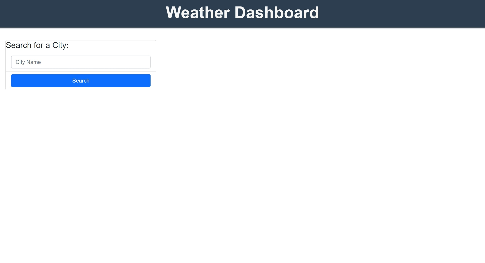
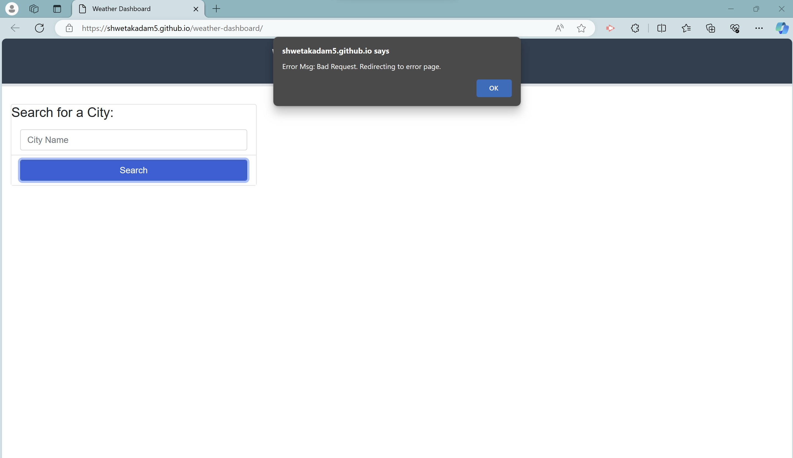
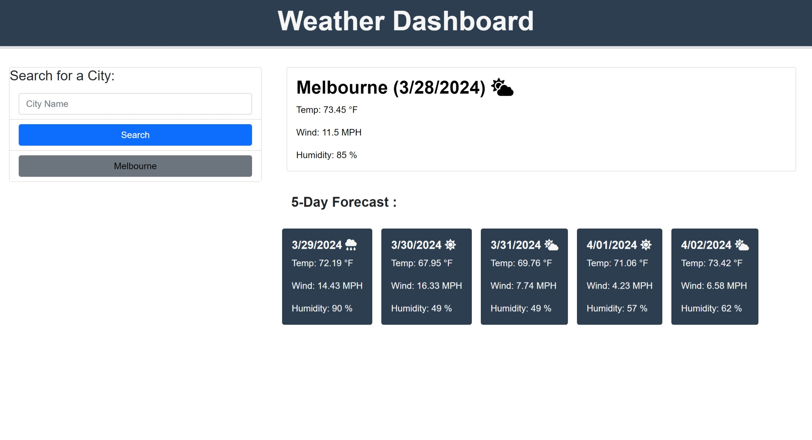
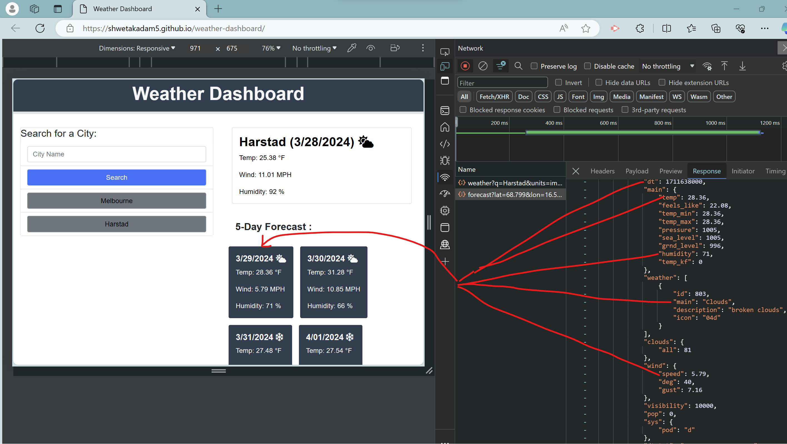

# weather-dashboard

## Description

- This application provides a weather dashboard to view the current and the 5 day forecast weather for the desired cities. It also provides a search history option for previously looked up cities for each access.
- It includes accessing the data by making requests to the third party APIs by providing specific parameters to the URL.
- The implementation of this project helped apply my knowledge on html, css, jquery, github for repostitory management, use of server side apis,network activity, use of fetch and handling the server data and errors.

## Table of Contents 

- [Installation](#installation)
- [User Story](#userstory)
- [Usage](#usage)
- [Acceptance Criteria](#acceptancecriteria)
- [Tests](#tests)
- [Credits](#credits)
- [License](#license)

## Installation

Follow these instructions to create your project and deploy it to GitHub Pages:

1. Create a new repository on your GitHub account and clone it to your computer.

2. When you're ready to deploy, use the git add, git commit, and git push commands to save and push your code to your GitHub repository.

3. Navigate to your GitHub repository in the browser and then select the Settings tab on the right side of the page.

4. On the Settings page, select Pages on the left side of the page. On the GitHub Pages screen, choose main in the dropdown under Branch. Click the Save button.

5. Navigate to <your-github-username.github.io/your-repository-name> and you will find that your new webpage has gone live! For example, if your GitHub username is "lernantino" and the project is "css-demo-site", then your URL would be <lernantino.github.io/css-demo-site>.


## User Story 

```
AS A traveler
I WANT to see the weather outlook for multiple cities
SO THAT I can plan a trip accordingly
```

## Usage

Link for the repository : 

https://github.com/shwetakadam5/weather-dashboard

Link for the webpage : 

https://shwetakadam5.github.io/weather-dashboard/

**Landing page :**



**Error handling pages**




**Search City Success Page**



**Search City Along with Server Response Mapping**



**Search by City and Search by History-City   : Functionality Demo**


## Acceptance Criteria

```
GIVEN a weather dashboard with form inputs
WHEN I search for a city
THEN I am presented with current and future conditions for that city and that city is added to the search history
WHEN I view current weather conditions for that city
THEN I am presented with the city name, the date, an icon representation of weather conditions, the temperature, the humidity, and the wind speed
WHEN I view future weather conditions for that city
THEN I am presented with a 5-day forecast that displays the date, an icon representation of weather conditions, the temperature, the wind speed, and the humidity
WHEN I click on a city in the search history
THEN I am again presented with current and future conditions for that city
```

## Tests

**Test 1**
- Click on the Search Button in the Search for a City section:  Providing valid city name
    User will be presented with Current weather conditions displaying :
        1. City Name
        2. Date (Current date)
        3. Weather ICON
        4. Temperature in fahrenheit
        5. Wind speed in miles per hour-MPH
        6. Humidity in percentage
   User will be presented with 5-day forecast of the weather conditions displaying : (5 weather cards)       
        1. Date (Unique dates after the current date)
        2. Weather ICON
        3. Temperature in fahrenheit
        4. Wind speed in miles per hour-MPH
        5. Humidity in percentage
    User will be presented with a search history button for the successfully searched city.
    

**Test 2**
- Click on the "CityName" Button in the Search for a City section: 
    User will be again presented with current weather conditions and the 5-day forecast for that city.

**Test 3**
- Click on the Search Button in the Search for a City section:  Providing invalid city name or blank  
    User will be presented with an alert box with error message. 
    On proceeding the user will be redirected to the server error page.

**Test 4**
- Click on the Back from the server error page  
    User will be redirected back to the home page with option to correct the invalid search text. 

**Test 5**
- All the user inputs have default text displayed, which can be updated by the user

**Test 6**
- Hover on the Search Button : Hover text will display "Click here to Search"
- Hover on the City Name input : Hover text will display "Enter the City Name here"
- Hover on the (Searched CityName) Button : Hover text will display "Cityname"

**Test 7**
- Check appropriate headers are displayed for every section.


## Credits

_List your collaborators, if any, with links to their GitHub profiles:_ NA

_If you used any third-party assets that require attribution, list the creators with links to their primary web presence in this section:_

https://getbootstrap.com/docs/5.3/getting-started/introduction/
https://day.js.org/
https://fontawesome.com/icons/categories/weather

_If you followed tutorials, include links to those here as well :_ NA


## License

MIT
